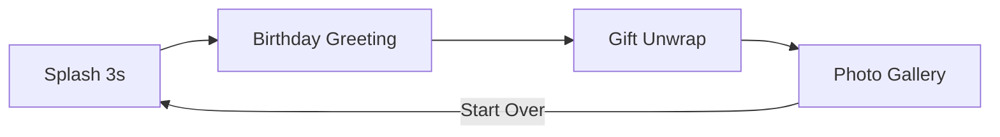

# Birthday Surprise App — Full Spec

## Overview

A cinematic, fully-animated birthday surprise web experience. Drop your photos and music into folders — the app auto-discovers everything and delivers a four-scene journey: splash → greeting → gift unwrap → photo gallery.

## Quick Start

```bash
npm install
npm run dev
```

Add your content:
- **Photos:** Drop `.png` files into `public/images/`
- **Music:** Drop `.mp3` files into `public/music/`

No filenames are shown. All images render in the gallery. All songs play sequentially in an infinite loop.

## User Flow



1. **Splash** — Aurora shader + star particles + glowing orb. Auto-advances after 3 seconds.
2. **Birthday** — Typewriter greeting, floating balloons, rotating 3D gift preview. Music starts. Tap "Open Your Surprise".
3. **Gift Unwrap** — Full-screen 3D gift with Bloom glow. Tap to unwrap: ribbon dissolves, lid flies off, 3000 particles explode, confetti bursts, white flash transition.
4. **Gallery** — Swiper 3D coverflow carousel of all photos. Confetti rain + floating hearts. Start Over returns to splash.

## Tech Stack

| Layer | Library |
|-------|---------|
| Build | Vite 8 |
| UI | React 19 |
| 3D | Three.js, React Three Fiber, Drei, Postprocessing |
| Animation | GSAP, Framer Motion |
| Particles | tsparticles |
| Audio | Howler.js (sequential playlist, crossfade) |
| Gallery | Swiper (EffectCoverflow) |
| Text | typewriter-effect |
| Effects | canvas-confetti |

## Project Structure

```
public/
├── images/          ← Drop PNG photos here
├── music/           ← Drop MP3 songs here
└── asset-manifest.json  (auto-generated at build)

src/
├── components/
│   ├── scenes/      SplashScene, BirthdayScene, GiftScene, GalleryScene
│   ├── three/       AuroraBackground, GiftBox, ParticleExplosion
│   └── ui/          AudioEngine, ParticleField, FloatingBalloons, etc.
├── hooks/           useAssets.js
├── context/         AudioContext.jsx
├── styles/          globals, animations, scenes
├── App.jsx          Stage machine
└── main.jsx
```

## Asset Auto-Discovery

A Vite plugin scans `public/images/*.png` and `public/music/*.mp3` at dev/build time and exposes them via `virtual:assets`. Adding or removing files triggers a hot reload.

## Audio

- Playlist starts on the Birthday scene (after splash auto-advance counts as user engagement chain).
- Songs play one after another with crossfade. Loops infinitely.
- Mute toggle (top-right) — no song names displayed.

## Customization

- Edit greeting text in `BirthdayScene.jsx`
- Edit gallery header in `GalleryScene.jsx`
- Adjust colors in `src/styles/globals.css` CSS variables
- Change splash duration in `SplashScene.jsx` (default 3000ms)

## Build & Deploy

```bash
npm run build
npm run preview
```

Production base path: `/gim-bdy/` (GitHub Pages). Configured in `vite.config.js`.

## Accessibility

- Semantic HTML and ARIA labels on scenes
- Keyboard navigation in photo gallery (← →)
- `prefers-reduced-motion` respected in CSS
- Mute control for audio
